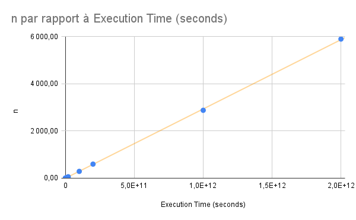

# USTHB University - Faculty of Computer Science Algiers  
**Module**: Advanced Algorithms and Complexity - 3 Soft Eng  
**Lab 1**:  Algorithms, Programming, and Complexity
**2024-2025**  
**B. Dellal-Hedjazi**  

**Done by**:  
- Rachedi Abderrahmane 
---

## Part I: Sum of the First N Natural Numbers

In this part, we revisit algorithms, programming, and complexity by solving a problem involving the calculation of the sum of the first \( n \) natural numbers. The problem is solved using **iterative programming**.

### Problem Statement
Develop an iterative algorithm and program to calculate the sum \( S \) of the first \( n \) natural numbers:
\[
S = \sum_{i=1}^{n} i = 1 + 2 + 3 + \dots + n
\]
where \( n \) is a natural integer read as input (\( n \geq 1 \)).

---

### 1. Iterative Algorithm (Sum_1)
The iterative algorithm, denoted **Sum_1**, uses a `while` loop to calculate the sum \( S \).

#### Algorithm Steps:
1. Read the input value \( n \) (ensure \( n \geq 1 \)).
2. Initialize a variable \( S \) to 0 to store the sum.
3. Initialize a counter variable \( i \) to 1.
4. Use a `while` loop to iterate from \( i = 1 \) to \( i = n \):
   - Add \( i \) to \( S \).
   - Increment \( i \) by 1.
5. Return the value of \( S \).

#### Pseudocode:
```
Sum_1(n):
    S = 0
    i = 1
    while i <= n:
        S = S + i
        i = i + 1
    return S
```

---

### 2. Time Complexity of the Algorithm
The time complexity of the algorithm **Sum_1** is determined by the number of iterations in the `while` loop.

- The loop runs \( n \) times (from \( i = 1 \) to \( i = n \)).
- Each iteration performs a constant number of operations (addition and increment).

Thus, the **time complexity** is:
\[
O(n)
\]

---

### 3. Space Complexity of the Algorithm
The space complexity is determined by the amount of memory used by the algorithm.

- The algorithm uses a constant amount of memory to store the variables \( S \), \( i \), and \( n \).
- No additional data structures are used.

Thus, the **space complexity** is:
\[
O(1)
\]

---

### 4. Iterative Program in C (PSum_1)
Below is the corresponding iterative program written in C. To handle large values of \( n \), the `double` type is used for the sum \( S \).

#### C Code:
```c
#include <stdio.h>

double PSum_1(int n) {
    double S = 0.0;
    int i = 1;
    while (i <= n) {
        S += i;
        i++;
    }
    return S;
}

int main() {
    int n;
    printf("Enter a natural number n (n >= 1): ");
    scanf("%d", &n);

    if (n < 1) {
        printf("Error: n must be greater than or equal to 1.\n");
        return 1;
    }

    double result = PSum_1(n);
    printf("The sum of the first %d natural numbers is: %.0f\n", n, result);

    return 0;
}
```

#### Explanation:
1. The function `PSum_1` implements the iterative algorithm using a `while` loop.
2. The `main` function reads the input \( n \), validates it, and calls `PSum_1` to compute the sum.
3. The result is printed as a double, but formatted to display as an integer using `%.0f`.

---

Here’s the rewritten **Part II** of your report, including the table and plot description:

---

## Part II: Measuring Execution Time

In this part, we learn how to measure the execution time of a program using the time management functions provided by the C standard library (`time.h`). We modify the previous program to measure the execution time for different values of \( n \) and analyze the results.

---

#### C Code:
```c
#include <stdio.h>
#include <time.h>

double PSum_2(long long int n) {
    double S = 0.0;
    long long int i = 1;
    while (i <= n) {
        S += i;
        i++;
    }
    return S;
}

int main() {
    double n_values[] = {1e6, 2e6, 1e7, 2e7, 1e8, 2e8, 1e9, 2e9, 1e10, 2e10, 1e11, 2e11, 1e12, 2e12};
    int num_values = sizeof(n_values) / sizeof(n_values[0]);

    // Open a CSV file for writing
    FILE *file = fopen("data.csv", "w");
    if (file == NULL) {
        printf("Error opening file!\n");
        return 1;
    }

    // Write the header to the CSV file
    fprintf(file, "n,Execution Time (seconds)\n");

    printf("n\t\tExecution Time (seconds)\n");
    printf("---------------------------------\n");

    for (int i = 0; i < num_values; i++) {
        long long int n = (long long int)n_values[i]; // Cast to long long int
        clock_t start = clock(); // Start time
        double result = PSum_2(n); // Call the function
        clock_t end = clock(); // End time

        double execution_time = (double)(end - start) / CLOCKS_PER_SEC;

        // Print to console
        printf("%lld\t\t%.6f\n", n, execution_time);

        // Write to CSV file
        fprintf(file, "%lld,%.6f\n", n, execution_time);
    }

    // Close the CSV file
    fclose(file);

    return 0;
}
```

### 1. Measuring Execution Time (PSum_2)

The program `PSum_2` calculates the sum of the first \( n \) natural numbers and measures the execution time for a range of \( n \) values. The results are recorded in the table below.

#### Table: Execution Times for Different Values of \( n \)

| \( n \)            | Execution Time (seconds) |
|---------------------|--------------------------|
| 1,000,000          | 0.00                     |
| 2,000,000          | 0.01                     |
| 10,000,000         | 0.03                     |
| 20,000,000         | 0.06                     |
| 100,000,000        | 0.30                     |
| 200,000,000        | 0.58                     |
| 1,000,000,000      | 2.84                     |
| 2,000,000,000      | 5.77                     |
| 10,000,000,000     | 29.13                    |
| 20,000,000,000     | 58.99                    |
| 100,000,000,000    | 287.81                   |
| 200,000,000,000    | 595.20                   |
| 1,000,000,000,000  | 2,878.99                 |
| 2,000,000,000,000  | 5,902.05                 |

---

### 2. Plotting the Curves


---

### 3. Comparison and Interpretation of Results

#### Theoretical Execution Time:
- The theoretical time complexity of the algorithm is \( O(n) \), meaning the execution time should increase linearly with \( n \).

#### Experimental Execution Time:
- The experimental results align with the theoretical \( O(n) \) complexity for small to moderate values of \( n \).


### Conclusion

- The experimental results confirm the theoretical \( O(n) \) time complexity for small to moderate input sizes.
- This exercise demonstrates the importance of both theoretical analysis and empirical measurement in understanding algorithm performance.
