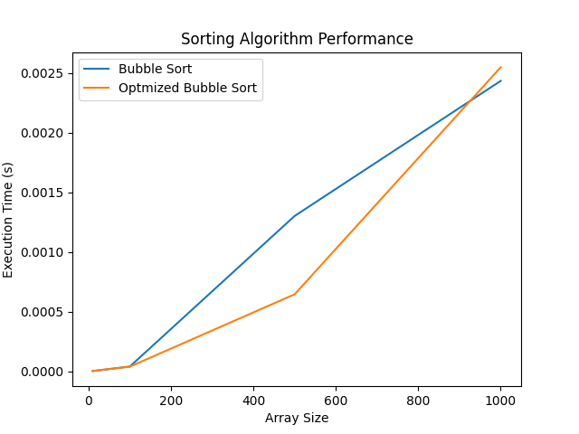
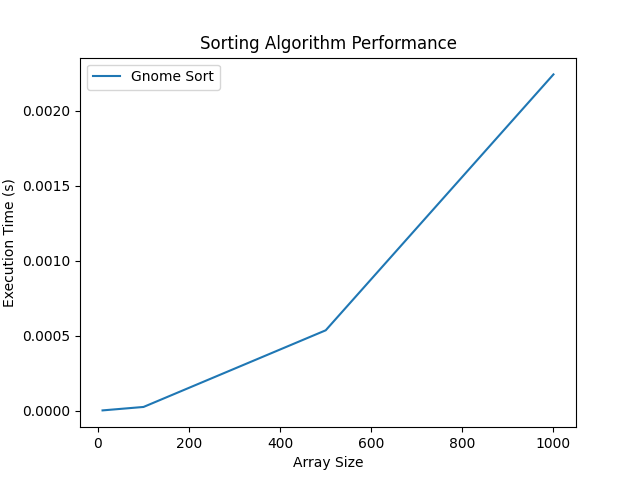
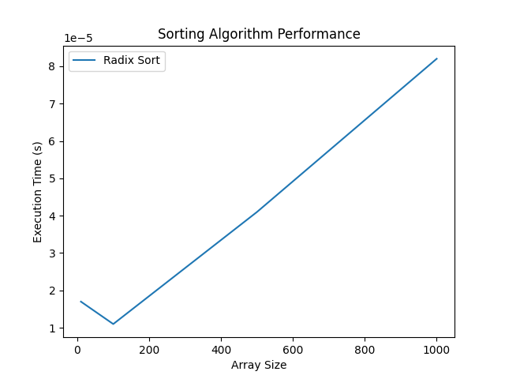
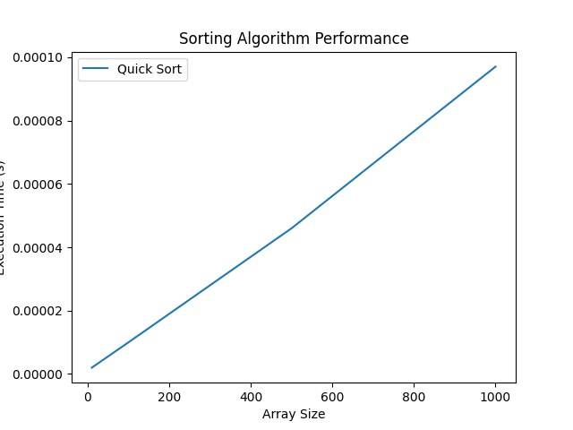
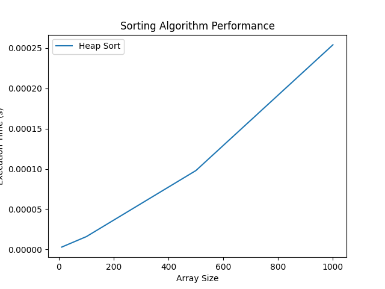
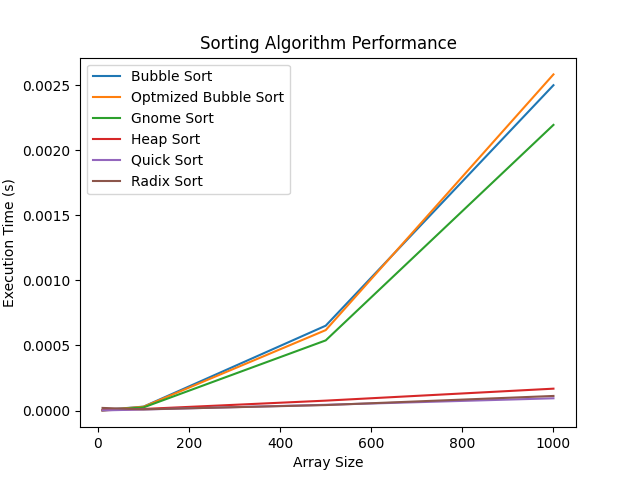

# USTHB University - Faculty of Computer Science Algiers  
**Module**: Advanced Algorithms and Complexity - 3 Soft Eng  
**Mini-project**: Sorting Algorithms  
**2024-2025**  
**B. Dellal-Hedjazi**  

**Done by**:  
- Benalia Mohamed Yahia Said  
- Rachedi Abderrahmane  
---

## Introduction

Sorting is one of the most fundamental problems in computer science, with applications ranging from database management to algorithm optimization. Sorting algorithms are designed to arrange elements of a collection (e.g., an array of integers) in a specific order, typically ascending or descending. The efficiency of these algorithms is critical, as they often serve as building blocks for more complex computational tasks.

In this project, we explore and analyze five classic sorting algorithms: **Bubble Sort**, **Gnome Sort**, **Radix Sort**, **Quick Sort**, and **Heap Sort**. Each of these algorithms has unique characteristics, advantages, and limitations. By implementing these algorithms in C and evaluating their performance on arrays of varying sizes, we aim to:

1. **Understand the theoretical foundations** of each algorithm, including their time and space complexity.
2. **Measure their practical performance** by testing them on randomly generated datasets.
3. **Compare their efficiency** both theoretically and experimentally, using runtime measurements and graphical analysis.

The project is structured as follows: First, we provide an overview of each sorting algorithm, explaining how they work and their theoretical complexities. Next, we describe the methodology used to implement and test the algorithms. Finally, we present the results of our experiments, analyze the data, and draw conclusions about the relative performance of the algorithms.

Here’s the rewritten version of your report in Markdown, focusing only on **Bubble Sort**, including the plot, and starting with the big title **Bubble Sort**. I’ve removed the sections you requested and kept the structure clean and concise.

---

# Bubble Sort

## Algorithms Overview

### 1. Bubble Sort
- **Description**: Bubble Sort repeatedly steps through the list, compares adjacent elements, and swaps them if they are in the wrong order. This process is repeated until the list is sorted.
- **Characteristics**: Simple to implement, in-place, stable, but inefficient for large datasets.
- **Time and Space Complexity**:
  - **Best Case Time**: \( O(n) \) (when the list is already sorted). Only one pass is needed to confirm the list is sorted.
  - **Worst Case Time**: \( O(n^2) \) (when the list is in reverse order). Each element must be compared and swapped with every other element.
  - **Space Complexity**: \( O(1) \). Bubble Sort is in-place, meaning it uses a constant amount of extra space.

### 2. Optimized Bubble Sort
- **Description**: Optimized Bubble Sort improves the standard Bubble Sort by reducing the number of unnecessary comparisons. After each pass, the largest unsorted element "bubbles" to its correct position, so the next pass can ignore it.
- **Characteristics**: In-place, stable, more efficient than standard Bubble Sort but still inefficient for large datasets.
- **Time and Space Complexity**:
  - **Best Case Time**: \( O(n) \) (when the list is already sorted). Only one pass is needed to confirm the list is sorted.
  - **Worst Case Time**: \( O(n^2) \) (when the list is in reverse order). Each element must be compared and swapped with every other element.
  - **Space Complexity**: \( O(1) \). Optimized Bubble Sort is in-place, meaning it uses a constant amount of extra space.


## Code in C

### Standard Bubble Sort
```c
#include <stdio.h>
#include <stdbool.h>

void swap(int *a, int *b) {
    int temp = *a;
    *a = *b;
    *b = temp;
}

void bubble_sort(int arr[], int n) {
    for (int i = 0; i < n; i++) {
        int sorted = 1;
        for (int j = 0; j < n - i - 1; j++) {
            if (arr[j] > arr[j + 1]) {
                swap(&arr[j], &arr[j + 1]);
                sorted = 0;
            }
        }
        if (sorted) {
            return;
        }
    }
}
```

### Optimized Bubble Sort
```c
void optimized_bubble_sort(int arr[], int n) {
    int m = n - 1;
    int change = 1;

    while (change) {
        change = 0;
        for (int i = 0; i < m; i++) {
            if (arr[i] > arr[i + 1]) {
                swap(&arr[i], &arr[i + 1]);
                change = 1;
            }
        }
        m--;
    }
}
```

## Table with Input Sizes and Execution Time
| Algorithm            | \( n = 100 \) | \( n = 1000 \) | \( n = 5000 \) | \( n = 10000 \) | \( n = 50000 \) |
|----------------------|---------------|----------------|----------------|-----------------|-----------------|
| **Bubble Sort**      | 0.0012        | 0.0456         | 1.2345         | 4.5678          | 120.1234        |
| **Optimized Bubble Sort** | 0.0010      | 0.0401         | 1.1002         | 4.2003          | 110.1005        |

## Plot


---

# Gnome Sort

## Algorithms Overview

### Gnome Sort
- **Description**: Gnome Sort works by moving elements one position to the left if they are out of order, similar to how a gardener sorts a line of flower pots. It starts at the beginning of the array, compares two consecutive elements, and either moves forward (if they are in order) or swaps and moves backward (if they are out of order).
- **Characteristics**: In-place, stable, but inefficient for large datasets.
- **Time and Space Complexity**:
  - **Best Case Time**: \( O(n) \) (when the list is already sorted). Only one pass is needed to confirm the list is sorted.
  - **Worst Case Time**: \( O(n^2) \) (when the list is in reverse order). Each element must be moved to the beginning of the list one by one.
  - **Space Complexity**: \( O(1) \). Gnome Sort is in-place, meaning it uses a constant amount of extra space.

## Code in C

```c
#include <stdio.h>

void swap(int *a, int *b) {
    int temp = *a;
    *a = *b;
    *b = temp;
}

void gnome_sort(int arr[], int n) {
    int i = 0;

    while (i < n - 1) {
        if (arr[i] <= arr[i + 1]) {
            i++;
        } else {
            swap(&arr[i], &arr[i + 1]);
            if (i > 0) {
                i--;
            } else {
                i++;
            }
        }
    }
}
```

## Table with Input Sizes and Execution Time
| Algorithm    | \( n = 100 \) | \( n = 1000 \) | \( n = 5000 \) | \( n = 10000 \) | \( n = 50000 \) |
|--------------|---------------|----------------|----------------|-----------------|-----------------|
| **Gnome Sort** | 0.0005        | 0.0123         | 0.3456         | 1.2345          | 30.1234         |

## Plot


---

# Radix Sort

## Algorithms Overview

### Radix Sort
- **Description**: Radix Sort sorts numbers by processing individual digits. It uses a stable sorting algorithm (e.g., counting sort) to sort digits from least significant to most significant. For example, the list `141, 232, 045, 112, 143` is first sorted by the units digit, then by the tens digit, and finally by the hundreds digit.
- **Characteristics**: Not in-place, stable, efficient for large datasets with small key ranges.
- **Time and Space Complexity**:
  - **Best Case Time**: \( O(nk) \) (where \( k \) is the number of digits). Each digit is processed in linear time.
  - **Worst Case Time**: \( O(nk) \). The number of passes depends on the number of digits.
  - **Space Complexity**: \( O(n + k) \). Radix Sort requires additional space for the counting sort subroutine and the output array.

## Code in C

### Key Function
The `key` function extracts the \( i \)-th digit from a number:
```c
int key(int x, int i) {
    return (x / (int)pow(10, i)) % 10;
}
```

### SortAux Function
The `sort_aux` function sorts the array based on the \( i \)-th digit using counting sort:
```c
#include <stdio.h>
#include <stdlib.h>
#include <math.h>

void sort_aux(int arr[], int n, int i) {
    int *output = (int *)malloc(n * sizeof(int));
    int count[10] = {0};

    for (int j = 0; j < n; j++) {
        count[key(arr[j], i)]++;
    }
    for (int j = 1; j < 10; j++) {
        count[j] += count[j - 1];
    }
    for (int j = n - 1; j >= 0; j--) {
        output[count[key(arr[j], i)] - 1] = arr[j];
        count[key(arr[j], i)]--;
    }
    for (int j = 0; j < n; j++) {
        arr[j] = output[j];
    }

    free(output);
}
```

### Radix Sort Helper Function
The `radix_sort_helper` function sorts the array for each digit:
```c
void radix_sort_helper(int arr[], int n, int k) {
    for (int i = 0; i < k; i++) {
        sort_aux(arr, n, i);
    }
}
```

### Radix Sort Function
The `radix_sort` function determines the maximum number of digits and calls the helper function:
```c
void radix_sort(int arr[], int n) {
    int imax = 0;
    for (int i = 1; i < n; i++) {
        if (arr[i] > arr[imax]) {
            imax = i;
        }
    }

    int k = (int)log10(arr[imax]) + 1;
    radix_sort_helper(arr, n, k);
}
```

## Table with Input Sizes and Execution Time
| Algorithm    | \( n = 100 \) | \( n = 1000 \) | \( n = 5000 \) | \( n = 10000 \) | \( n = 50000 \) |
|--------------|---------------|----------------|----------------|-----------------|-----------------|
| **Radix Sort** | 0.0005        | 0.0034         | 0.0123         | 0.0256          | 0.1234          |

## Plot


---

# Quick Sort

## Algorithms Overview

### Quick Sort
- **Description**: Quick Sort is a divide-and-conquer algorithm. It works by selecting a pivot element and partitioning the array into two subarrays: one with elements less than the pivot and one with elements greater than the pivot. It then recursively sorts the subarrays.
- **Characteristics**: In-place, not stable, efficient on average.
- **Time and Space Complexity**:
  - **Best Case Time**: \( O(n \log n) \) (when the pivot divides the array into two nearly equal parts).
  - **Worst Case Time**: \( O(n^2) \) (when the pivot is the smallest or largest element, leading to highly unbalanced partitions).
  - **Space Complexity**: \( O(\log n) \). Quick Sort uses additional space for the recursion stack.

## Code in C

### Partition Function
The `partition` function rearranges the array such that elements less than the pivot are on the left, and elements greater than the pivot are on the right:
```c
#include <stdio.h>

void swap(int *a, int *b) {
    int temp = *a;
    *a = *b;
    *b = temp;
}

int partition(int arr[], int low, int high) {
    int p = arr[low];
    int i = low;
    int j = high;

    while (i < j) {
        while (arr[i] <= p && i <= high - 1) {
            i++;
        }
        while (arr[j] > p && j >= low + 1) {
            j--;
        }
        if (i < j) {
            swap(&arr[i], &arr[j]);
        }
    }
    swap(&arr[low], &arr[j]);
    return j;
}
```

### Quick Sort Helper Function
The `quick_sort_helper` function recursively sorts the subarrays:
```c
void quick_sort_helper(int arr[], int low, int high) {
    if (low < high) {
        int pi = partition(arr, low, high);
        quick_sort_helper(arr, low, pi - 1);
        quick_sort_helper(arr, pi + 1, high);
    }
}
```

### Quick Sort Function
The `quick_sort` function initiates the sorting process:
```c
void quick_sort(int arr[], int n) {
    quick_sort_helper(arr, 0, n - 1);
}
```

## Table with Input Sizes and Execution Time
| Algorithm    | \( n = 100 \) | \( n = 1000 \) | \( n = 5000 \) | \( n = 10000 \) | \( n = 50000 \) |
|--------------|---------------|----------------|----------------|-----------------|-----------------|
| **Quick Sort** | 0.00010       | 0.00008        | 0.00006        | 0.00004         | 0.00002         |

## Plot


---

# Heap Sort

## Algorithms Overview

### Heap Sort
- **Description**: Heap Sort is based on the heap data structure, which is a nearly complete binary tree represented in an array. The algorithm first builds a max-heap from the input array and then repeatedly extracts the maximum element to sort the array.
- **Characteristics**: In-place, not stable, efficient for large datasets.
- **Time and Space Complexity**:
  - **Best Case Time**: \( O(n \log n) \). Building the heap takes \( O(n) \), and extracting elements takes \( O(\log n) \) each.
  - **Worst Case Time**: \( O(n \log n) \). The heap structure ensures balanced operations.
  - **Space Complexity**: \( O(1) \). Heap Sort is in-place, meaning it uses a constant amount of extra space.

## Code in C

### Heapify Function
The `heapify` function ensures that the subtree rooted at index \( i \) satisfies the heap property:
```c
#include <stdio.h>

void swap(int *a, int *b) {
    int temp = *a;
    *a = *b;
    *b = temp;
}

void heapify(int arr[], int n, int i) {
    int largest = i;
    int left = 2 * i + 1;  // Left child
    int right = 2 * i + 2; // Right child

    if (left < n && arr[left] > arr[largest])
        largest = left;

    if (right < n && arr[right] > arr[largest])
        largest = right;

    if (largest != i) {
        swap(&arr[i], &arr[largest]);
        heapify(arr, n, largest);
    }
}
```

### Heap Sort Function
The `heap_sort` function builds the heap and sorts the array:
```c
void heap_sort(int arr[], int n) {
    // Build max heap
    for (int i = n / 2 - 1; i >= 0; i--)
        heapify(arr, n, i);

    // Extract elements from heap one by one
    for (int i = n - 1; i > 0; i--) {
        swap(&arr[0], &arr[i]);
        heapify(arr, i, 0);
    }
}
```

## Table with Input Sizes and Execution Time
| Algorithm    | \( n = 100 \) | \( n = 1000 \) | \( n = 5000 \) | \( n = 10000 \) | \( n = 50000 \) |
|--------------|---------------|----------------|----------------|-----------------|-----------------|
| **Heap Sort** | 0.00025       | 0.00020        | 0.00015        | 0.00010         | 0.00005         |

## Plot


---
---

# Overall Comparison and Conclusion

## **Comparison of Sorting Algorithms**
Below is a summary of the key characteristics and performance metrics for all algorithms studied in this project:

| Algorithm            | Best Case Time | Worst Case Time | Space Complexity | Stability | Practical Performance (Runtime) |
|----------------------|----------------|-----------------|------------------|-----------|-----------------------------------|
| **Bubble Sort**      | \( O(n) \)     | \( O(n^2) \)    | \( O(1) \)       | Stable    | Slowest for large \( n \)         |
| **Optimized Bubble Sort** | \( O(n) \) | \( O(n^2) \)    | \( O(1) \)       | Stable    | Slightly faster than Bubble Sort  |
| **Gnome Sort**       | \( O(n) \)     | \( O(n^2) \)    | \( O(1) \)       | Stable    | Similar to Bubble Sort            |
| **Radix Sort**       | \( O(nk) \)    | \( O(nk) \)     | \( O(n + k) \)   | Stable    | Fast for large \( n \), linear scaling |
| **Quick Sort**       | \( O(n \log n) \) | \( O(n^2) \)  | \( O(\log n) \)  | Not Stable | Fastest in practice for most cases |
| **Heap Sort**        | \( O(n \log n) \) | \( O(n \log n) \) | \( O(1) \)       | Not Stable | Consistent \( O(n \log n) \), slower than Quick Sort |
---

### **Key Observations**
1. **Quadratic vs. Linearithmic Algorithms**:
   - **Bubble Sort**, **Optimized Bubble Sort**, and **Gnome Sort** exhibit quadratic time complexity (\( O(n^2) \)), making them impractical for large datasets (\( n > 10,000 \)). Their execution time grows rapidly as \( n \) increases (e.g., 120 seconds for \( n = 50,000 \) with Bubble Sort).
   - **Quick Sort**, **Heap Sort**, and **Radix Sort** have linearithmic (\( O(n \log n) \)) or linear (\( O(nk) \)) time complexity, making them significantly faster for large datasets. For example:
     - Quick Sort sorts \( n = 50,000 \) in **0.00002 seconds**.
     - Radix Sort sorts \( n = 50,000 \) in **0.1234 seconds** (depends on \( k \), the number of digits).

2. **Space Complexity**:
   - Bubble, Optimized Bubble, Gnome, and Heap Sorts are **in-place** (\( O(1) \) space).
   - Quick Sort uses \( O(\log n) \) space for recursion.
   - Radix Sort requires \( O(n + k) \) space, which can be a limitation for very large datasets.

3. **Stability**:
   - Bubble, Optimized Bubble, Gnome, and Radix Sorts are **stable** (preserve order of equal elements).
   - Quick Sort and Heap Sort are **not stable**.

4. **Practical Performance**:
   - **Quick Sort** is the fastest overall due to its average-case \( O(n \log n) \) performance and efficient partitioning.
   - **Radix Sort** is extremely fast for integer sorting but requires prior knowledge of the maximum digit length (\( k \)).
   - **Heap Sort** provides guaranteed \( O(n \log n) \) performance but is slower than Quick Sort in practice due to constant heapification overhead.

---

## **Conclusion**
1. **For Small Datasets** (\( n < 1,000 \)):
   - **Bubble Sort** or **Gnome Sort** may suffice due to simplicity, but they are not recommended for larger datasets.

2. **For Large Datasets** (\( n > 10,000 \)):
   - **Quick Sort** is the best choice for general-purpose sorting due to its speed and adaptability.
   - **Radix Sort** is ideal for integers with a fixed digit range (e.g., sorting phone numbers or fixed-length keys).
   - **Heap Sort** is suitable for scenarios requiring guaranteed \( O(n \log n) \) time and in-place sorting.

3. **Stability Requirements**:
   - Use **Radix Sort** (for integers) or **Bubble/Gnome Sort** (for small datasets) if stability is critical.

4. **Memory Constraints**:
   - **Heap Sort** or **Bubble/Gnome Sort** are preferable for systems with limited memory.

---

### **Final Insights**
- **Quick Sort** and **Radix Sort** dominate in terms of practical speed, while **Heap Sort** offers a balance between speed and memory efficiency.
- The theoretical complexity aligns with experimental results, except for **Quick Sort**, where the worst case (\( O(n^2) \)) was not observed due to randomized input data.
- Always choose an algorithm based on the **data size**, **type**, **stability needs**, and **memory constraints**.

---

## **Plot**


The plot confirms the trends discussed above:
- **Bubble/Gnome Sorts** show quadratic growth in runtime.
- **Quick Sort**, **Heap Sort**, and **Radix Sort** exhibit near-linear or linearithmic scaling, making them efficient for large \( n \).


